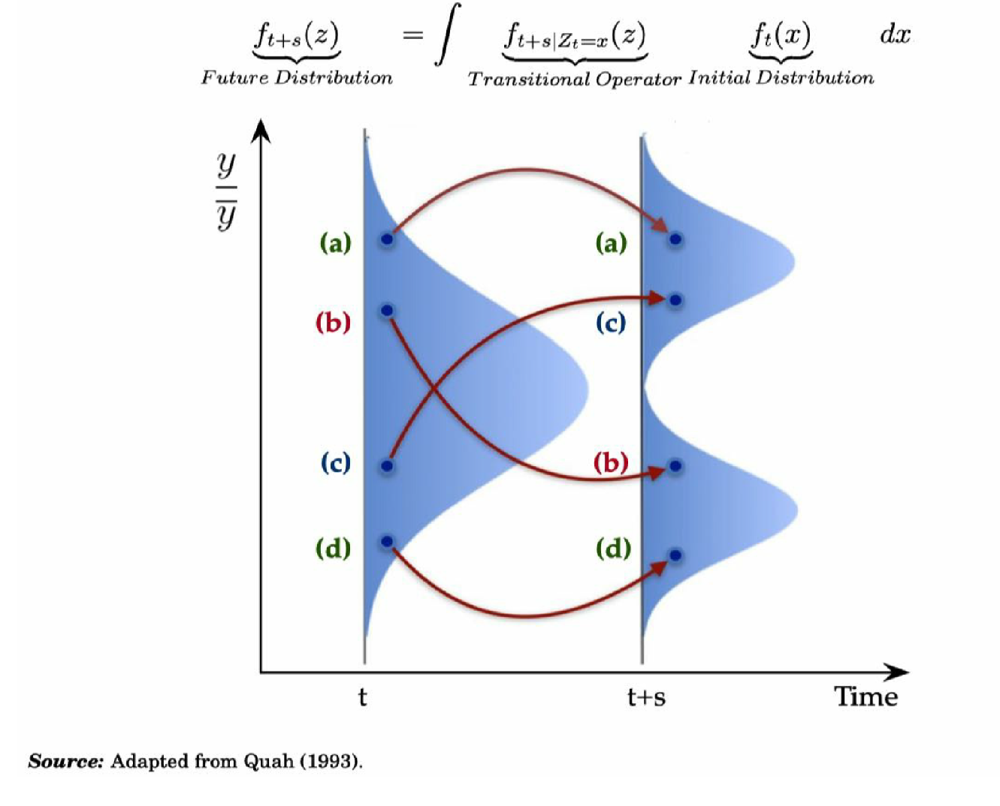
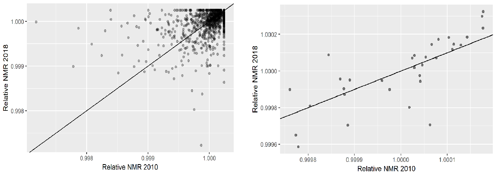
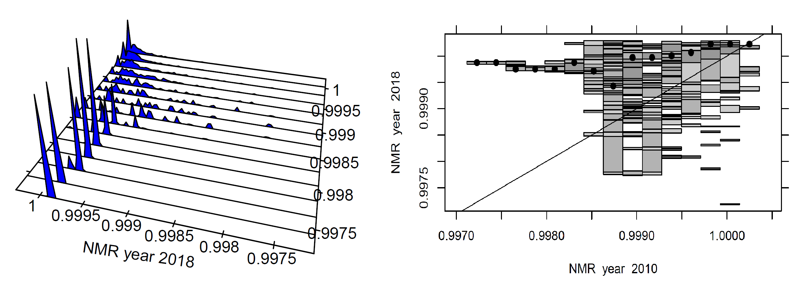
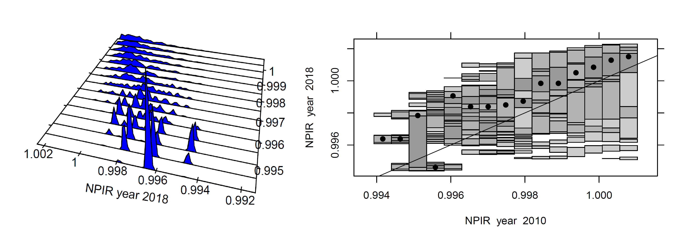
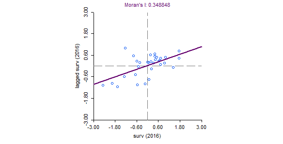
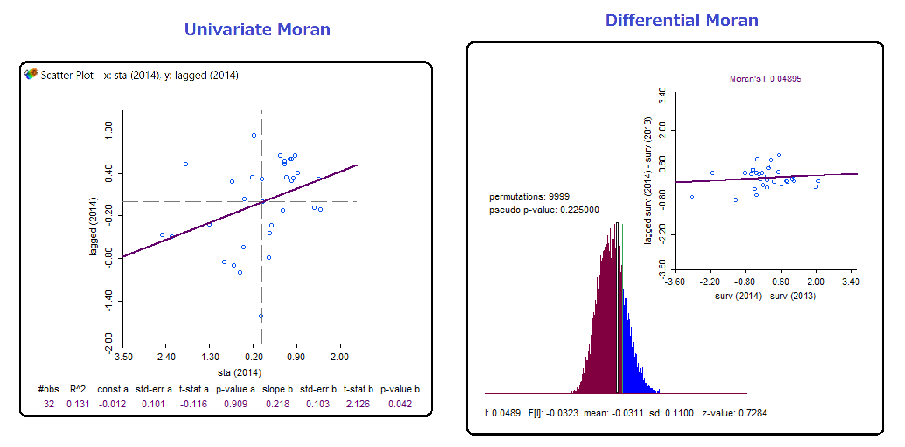
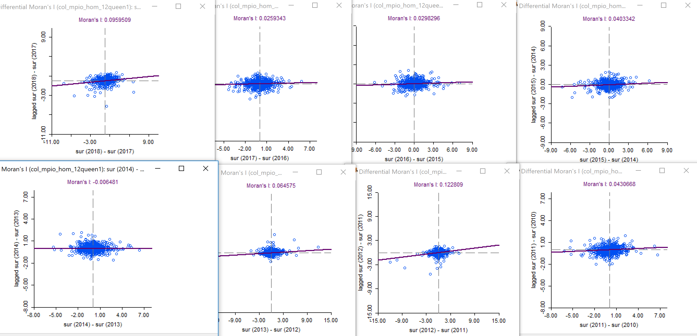
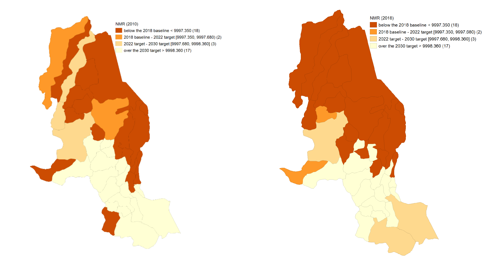

```{r setup, include=FALSE}
library(xaringan)
options(htmltools.dir.version = FALSE)
```


## Motivation:

- Beyond GDP, social variables and their convergence are relevant for development studies (Royuela et al 2015)

- Persistent income differences, differences in health indicators and in "general" regional inequality in Colombia. 

- Scarce academic literature on inequality (convergence approach) at the municipality level. 
  
## Research Objective:
  
- Study convergence/divergence of homicide rates and personal injury across municipalities and departments in Colombia 2010-2018 

- Analyze spatial autocorrelation and its robustness at different disaggregate levels

-Discuss policy implications of findings

  
## Methods:

- Classical convergence framework (Barro and Sala-i-Martin 1992)

- Distributional convergence framework (Quah 1996; Hyndman et. al 1996)

- Spatial autocorrelation (Moran's I)


---

class: middle

# Main Results:

1. **Sigma Convergence** for both rates at the state level, **Beta Convergence** for both levels and rates.

2. Regional disaggretation  matters: **Local convergence clusters** 

3. **Clustering dynamics** 

  - NMR State level: 4+? convergence clusters
  - NMR Municipal level: 2+? convergence clusters
  -NPIR State level: 2 convergence clubs
  -NPIR Municipal level: divergence and 2 convergence clubs

4. **Spatial Autocorrelation** robust only  at the municipality level
  

---

class: middle

# Outline of this presentation

1. **Data description** Survival rates (not homicide rates)

2. **Global convergence:** Using classical summary measures

  - Beta convergence 
  - Sigma convergence 

3. **Regional disaggregation:** 

  - Distribution dynamics framework
  - Distributional convergence

4. **Global spatial autocorrelation:**

  - Disaggreagation effects
  
5. **Policy discussion**

  - Colombian National Development Plan
  
  - RCT and spatial autocorrelation
  
5. **Concluding Remarks**
  
---

class: middle

# Data:

- Total number of homicides and personal injuries  in Colombia per year from 2010 until 2018 (data taken from the National police).

- Data is agreggated at the municipality  and departament level.

- Population census and estimates for states and municipalitites.

- Raw rates computed $$Hrate= homicides/population$$

- Survival rates (non- murder rates) computed　
   $$NMR= 10000- raw\ rate * 10000$$
- **Survival rates** are chosen because positively defined variables are a **standard** in the convergence literature. 

---

class: center, middle

# (2) **Global convergence:**
**Using classical summary measures**

Beta convergence

Sigma convergence

---

class: middle,center

##  States- Sigma and Beta convergence

$$\sigma (Standard \ \space deviation)\space\sigma_{2010}= 1.84\space\space\space\space\space \sigma_{2018}=1.26$$

$$log{\frac{Y_t}{Y_0}}=\alpha +\beta *logY_0+ \epsilon \space\space\space\space\space\beta=-0.476^{***} \space\space\space\space halflife=8.59\space  years$$


---

class: middle, center

## Municipalities - Beta convergence (only)

$$log{\frac{Y_t}{Y_0}}=\alpha +\beta *logY_0+ \epsilon \space\space\space\space\space\beta=-0.551^{***} \space\space\space\space halflife=6.92\space  years$$


---

class: middle, center

## Beta and sigma convergence  summary


---
class: center, middle

# (3) **State and Municipality disaggregation:** 

 Distribution dynamics framework
 
 Distributional convergence
 class: middle

# Regional heterogeneity matters

Dynamics of the **entire regional distribution**

**conditional density** estimation


---
class: middle, center

## The distribution dynamics framework



---
class: middle, center

# (4) Local convergence clusters

State level: 4+? convergence clusters

Municipality level: 2+? convergence clusters

---
class: middle, center

# Where are the clusters?

Municipality level     **- - - - - - - - - - - -  - -**     Department Level




Those lines are not regression trends!

---
class: middle, center
##NMR at both levels

 State level: 4+? convergence clusters
 
 


Municipality level: 2+? convergence clusters



Interesting results; there are fewer clusters but sigma convergence is not present.

---
class: middle, center

##NPIR at both levels

 State level: 2 convergence clusters
 
 


Municipality level: 2 convergence clusters and divergence



Interesting results; there are fewer clusters but sigma convergence is not present.

---
class: middle

# (4) Spatial Autocorrelation (moran I definition)

##**High Intuition Concept**      
 
##More Formal (less intuitive)

---
class: justify, center, middle

$$I = \frac{\sum_i\sum_j w_{ij} z_i.z_j}{\sum_i z_i^2} = \frac{\sum_i (z_i \times \sum_j w_{ij} z_j)}{\sum_i z_i^2}.$$
 In the linear regression **y=α+βx**
, the estimate for 
**β**
is $\sum_i (x_i \times y_i) / \sum_i x_i^2$.In the Moran scatter plot shown below,  **y** is the spatial lag variable $\sum_j w_{ij} z_j$



##Differential Moran Scatter Plot ( $y_{i,t}−y_{i,t−1}$ )
Differencing the variable to control for the locational fixed effects: We computate the Moran's I  for the  variable 
$y_{i,t}−y_{i,t−1}$. If we consider there is a  fixed effect  $\mu_i$ related to location $i$, it is possible to present the value at each location for time $t$ as the sum of some intrinsic value and the fixed effect. $y_{i,t} = y*_{i,t} + \mu_i$ (Geoda documentation 2019)


---

class: middle, center

# (4) Spatial autocorrelation 

1. **State level**: Moran's I statistic significant, differntial Moran's I is not significant (**not robust**)

2. **Municipality level**: Differential Moran's I significant  (**robust**)


---

# (4) Spatial autocorrelation 
## State level (not robust)

- Univatiate Moran's I is significant from 2012.
- But, **The differential moran statistic is not significant**. It is then considered that the significance of Spatial Autocorrelation is **not robust**.
- See plots for 2014 and 2014-2013, similar for other years (standarized variables)



---

# (4) Spatial autocorrelation 
## Municipality level  (**Robust**)

- The univariate Moran's  I is not significant in 2010 and 2011. however, it is significant from 2012 to  2018;  reaching a maximum value in 2016.
- Differential Moran's I ( $sur_{2018}-sur_{2010}$ ) is **significant** $Moran's\ I = 0.22^{***}$ 
- Subsequent Differential Moran's I $sur_{t}-sur_{t-1}$ **statistically significant at the municipality level**. Except 2014-2013 (not statistically significant) see graphs



---

class: middle, center

#(4) Policy discussion 

vertical and horizontal policy coordiantion:

It could be more appropriate for the formulation of national development plans to have convergence targets at the state level as well as the municipal level

 


---

#(4) Policy discussion 

##The need for a spatial perspective in current cash transfer programs:
	
-  Spatial regressions could be used to test determinant hypothesis  
 
- Moreover, such research could contribute to the literature by suggesting a case for spatially focused CCTs. 
 
- Ultimately, this type of analysis could serve a as tool for combating organized crime in specific locations 

 
 
 Camacho, A., & Mejía, D. (2013). Las externalidades de los programas de transferencias condicionadas sobre el crimen: El caso de Familias en Acción en Bogotá (No. IDB-WP-406). IDB Working Paper Series

---

# (5) Concluding Remarks

## Uplifting results  "on average" :

- Differences in overall raw rates at the state level **have decreased** and the means at both levels have increased (survival rate)

- **Global convergence on average at the state level**, while  fast beta convergence at the municipality level.

## Beyond classical convergence  :

- Regional differences matter in **both disaggreagation levels**.

- **Multiple local convergence clubs**; with more clubs at the state level.

## The Role of Space

- Subsequent Differential Moran's I are robust and significant at the **municipality level only**
- Results at the **state level** are not conlusive and similar to the ones reported by Royuela et al 2015.


---
# (5) Concluding Remarks

# Implications and further research

- Strong spatial autocorrelation suggest the posibility of applying the Getis filtering in order to filter the spatial component of homicide variables.  

- Convergence clusters help us to find regions with similar outcomes, coordination among them can be promoted.


- Has crime followed a trajectory? can a speed and direction of contagious patterns be found?

- At the state or department level (including more variables) can a probit model help us to find the determinants for a conditional "jump" to the upper clusters.


---
class: center, middle

# Thank you very much for your attention

If you are interested in our research,
you can check my webisite where you can find this presentation https://felipe-santos.rbind.io
please check Prof. Carlos Mendez website 
https://carlos-mendez.rbind.io

And our QuaRCS lab website 
https://quarcs-lab.rbind.io/

 


***

Stay tuned for my Master's thesis 
##Will the SGDs be Achieved in Colombia? A Study of National Convergence and Regional differences.

Gender inequality, Income, Eduacation, Crime... Classical convergence, Distributional Dynamics, Spatial Filtering, Spatial econometrics, long-run Filtering...
